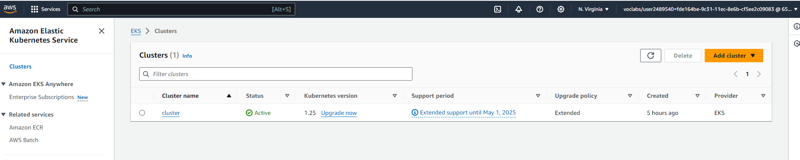

Link Git Hub   : https://github.com/lam1806/project4-devops-udacity

CD backend     : https://github.com/lam1806/project4-devops-udacity/actions/workflows/lamnt63-be-cd.yml
CD frontend    : https://github.com/lam1806/project4-devops-udacity/actions/workflows/lamnt63-fe-cd.yml

ScreenShot: 

Frontend-CICD  :  
                  
Backend-CICD   :  
                  

ECR :  
      
        

EKS : 
      

VPC:  
EC2:  

Load Balancer : 

Link web: http://ae68d2359cc4543f8a39225e1f2547a6-1186355695.us-east-1.elb.amazonaws.com/

         
